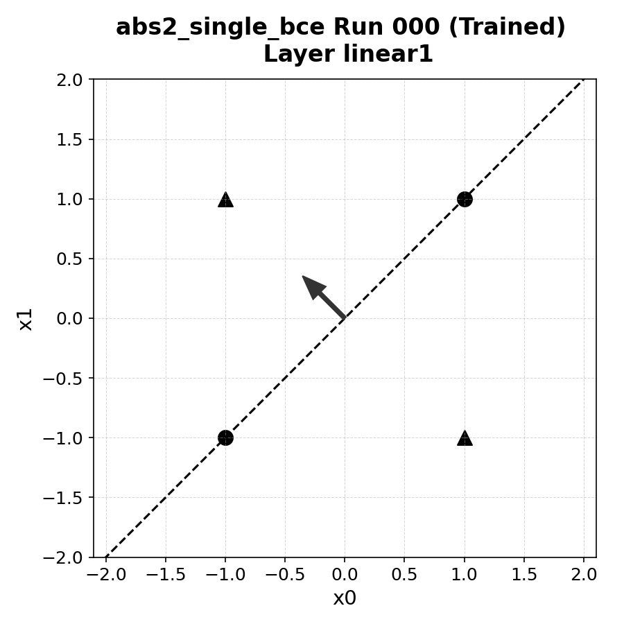
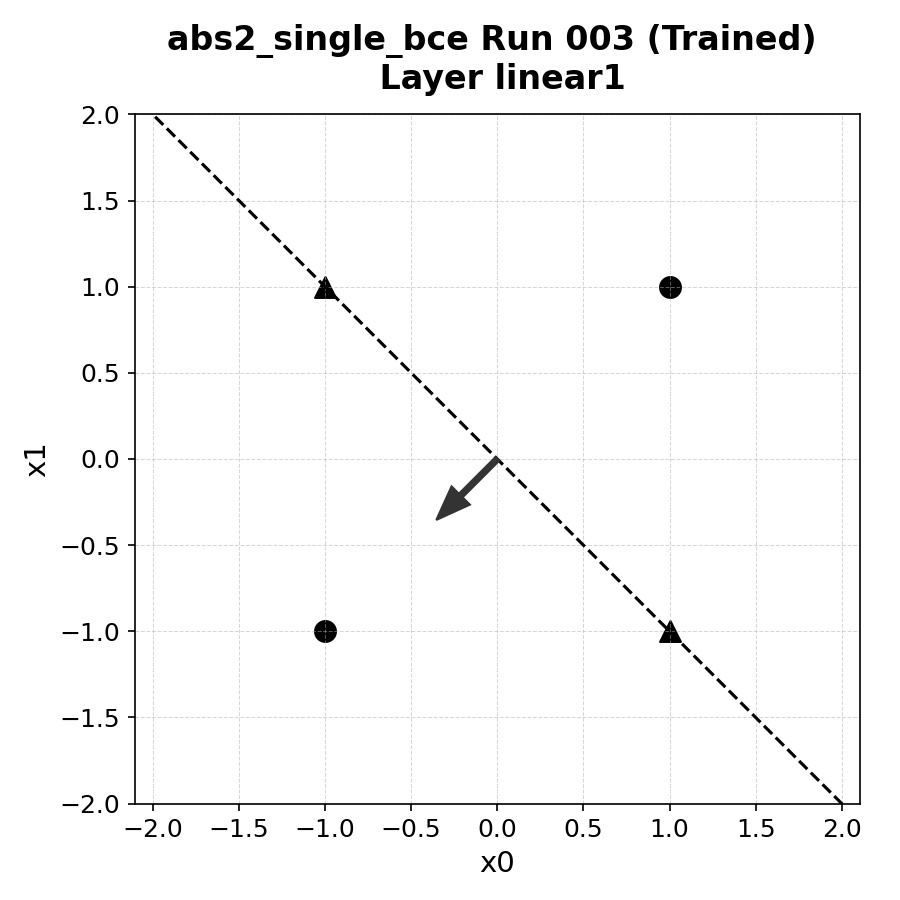

# **Results: Single Absolute Value Unit with BCE Loss (abs2) [DRAFT]**

## 1. Overview

This document presents a preliminary analysis of empirical results from the `abs2_single_bce` experiment. This experiment tested a two-layer MLP, using a single absolute value unit in the first layer, on the centered XOR dataset under a Binary Cross-Entropy (BCE) loss function. All 50 runs successfully converged to 100% classification accuracy.

The key finding from this initial analysis is that moving to a standard classification framework (BCE loss with two logit outputs) fundamentally alters the learning dynamics and the final learned geometry compared to the simpler regression-based `abs1` model. While functionally successful, the model converges much more slowly to its low-loss target and discovers a more varied set of geometric solutions, prompting the need for more nuanced analysis.

## 2. High-Level Summary

The following table summarizes the primary outcomes of the experiment. Note the dramatic increase in the number of epochs required to reach the final low-loss state compared to previous experiments, despite achieving 100% classification accuracy much earlier.

| Experiment          | Median Convergence Epochs (to Loss < 1e-7) | Final Accuracy |
| :------------------ | :----------------------------------------- | :------------- |
| **abs2_single_bce** | 3131                                       | 100%           |

---

## 3. Detailed Convergence Speed

While all runs achieved 100% classification accuracy relatively quickly (informally estimated to be within 50-200 epochs), the time required to meet the strict loss threshold of `< 1.0e-7` was significantly longer. The distribution of convergence times to this final low-loss state is detailed below.

| Percentile    | Epochs |
| :------------ | :----- |
| 0th           | 2934   |
| 10th          | 3016   |
| 25th          | 3082   |
| 50th (Median) | 3131   |
| 75th          | 3208   |
| 90th          | 3242   |
| 100th         | 3332   |

The stark difference between the time to achieve functional accuracy and the time to minimize the loss suggests that the optimization process is characterized by a long, slow refinement of the output logits to increase prediction confidence.

---

## 4. Final Loss Distribution

Training was configured to stop if the BCE loss fell below `1.0e-7` or stagnated. The final loss values were highly consistent across all runs.

| Metric        | Value    |
| :------------ | :------- |
| **Mean Final Loss** | 9.70e-08 |
| **Variance** | 1.24e-15 |

---

## 5. Prototype Surface Geometry

A preliminary analysis of the learned geometry in the first linear layer (`linear1`) reveals a significant departure from the `abs1` model. The raw statistical average of the hyperplane's distance to each class is misleading because the model learns at least two distinct solution modes.

Visual analysis of individual runs confirms this hypothesis:

* **Mode 1:** The learned hyperplane is anchored on the `XOR=False` class points (circles).

* **Mode 2:** The learned hyperplane is anchored on the `XOR=True` class points (triangles).

The BCE loss framework does not compel the model to favor one mode over the other, allowing the optimizer to converge to either valid solution. The aggregated statistics average these two distinct behaviors, obscuring the underlying geometric clarity. A more sophisticated analysis, likely involving clustering based on which class is closest to the learned surface, is required to properly characterize these results.

---

## 6. Weight Reorientation and Scaling Dynamics

Unlike in the `abs1` experiments, the initial geometry (both angle and norm ratio) of the weights in either layer shows no clear correlation with the number of epochs required to reach the final low-loss state. The convergence time is remarkably consistent regardless of the starting parameters.

This suggests that the primary bottleneck for convergence is not the initial distance from an optimal geometric configuration, but rather the intrinsic difficulty and slow nature of minimizing the BCE loss in this two-layer architecture.

### Layer `linear1` - Angle Change vs. Convergence

| Percentile | Angle Range (°) | Mean Epochs to Convergence |
| :--------- | :-------------- | :------------------------- |
| 0–10%      | 0.1 – 7.0       | 3220.2                     |
| 10–25%     | 7.0 – 11.3      | 3161.6                     |
| 25–50%     | 11.3 – 22.3     | 3127.8                     |
| 50–75%     | 22.3 – 44.0     | 3111.5                     |
| 75–90%     | 44.0 – 62.2     | 3130.1                     |
| 90–100%    | 62.2 – 89.0     | 3109.0                     |

---

## 7. Final Hyperplane Clustering

The clustering analysis of the final weights reflects the complexities discussed above.

### Layer `linear1` Clustering

The analysis algorithm discovered 11 distinct clusters and 8 noise points for the `linear1` weights. This "messy" result is predicted to be an artifact of the unconstrained magnitude of the learned weight vectors. Different runs can find solutions with the same hyperplane *orientation* but different weight vector *lengths*, which confounds a clustering algorithm based on raw weight values.

Beneath this noise, we expect to find four primary solution orientations: two diagonal solutions (`y = x` and `y = -x`), each with two possible perpendicular weight vectors. Normalizing the weight vectors before clustering is necessary to confirm this hypothesis.

### Layer `linear2` Clustering

The second linear layer (`linear2`) consistently learns to function as a linear classifier that interprets the distance feature provided by the first layer. It discovers one of two symmetric solutions, reflected in its weights and biases. For example, a common solution has weights approximating `[+C, -C]` and biases `[-D, +D]`, while another solution finds the opposite: `[-C, +C]` and `[+D, -D]`.

This confirms that the second layer reliably learns to map the single scalar distance into two opposing logits, correctly assigning high confidence to the appropriate class based on whether the distance is small or large.